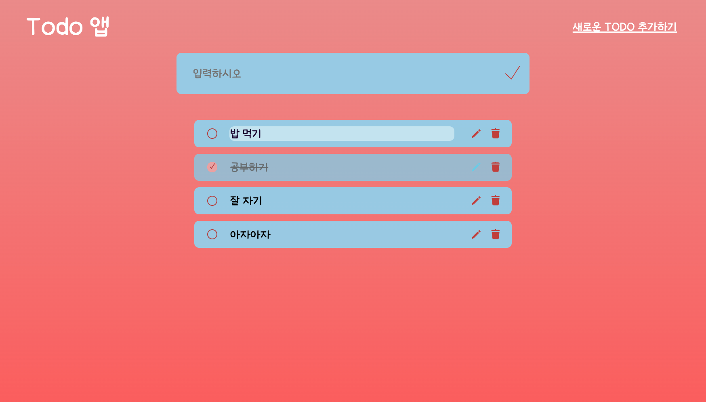

# Todo 앱

## 구현하고자 한 것

### 학습 목표

- 변수명 명확하게 설정
- 최소 기능만을 하도록 함수 구현
- localStorage 사용

## 기록

### 배운 점

#### UI 및 기능

- 오른쪽 상단 <새로운 TODO 추가하기> 버튼을 누르면 입력하는 창이 생겼다가 사라지는 걸 구현

  - JS: toggle('hidden'), CSS(visible, opacity, position)
  - display: none -> 할 경우 transition 적용이 되지 않아(none에는 불가) 위 형태로 구현

- 완료 누르면 완료되지 않은 것과 구분짓기

  - JS: toggle('complete'), li에 있는 class로 상태 구분해 자식 요소인 span, input에 영향 주는 CSS 작성
  - 완료일 때 수정 불가하므로 휴지통 모양만 본래값으로 보이게 설정

- 얼마나 입력하든 배경 하단에 일정 여유 주고, 배경 그라데이션 끊이지 않게 하기

  - 적게 입력해도 일정 부분 이상 보이도록 body{min-height}
  - 많이 입력 시 하단에 여유 주기 위해 .todos{margin} 이용

- 새로 고침해도 목록, 완료 여부, 그에 따른 CSS 유지

  - localStorage 키 저장, id, name, complete 여부 저장
  - 불러올 때 complete 값이 1이면 class 입력하도록 작성

- 아이콘 누르는 느낌 구현

  - checkbox 완료 눌렀을 때 '✓' 기호 나타나게 하기
    - before 사용, before, scale(0->0.9), transition 이용해 누르는 느낌 구현
  - 입력창 아이콘, 목록 창 연필, 휴지통 아이콘
    - 각각 hover, active(scale 0.8) 시 누르는 느낌 구현

- 수정 입력 시

  - list 범위를 벗어나지 않고, 줄바꿈 없게: max-width, white-wrap 설정
  - 입력이 많아지면 input 크기가 가늘어지는 문제 -> min-width로 처리
  - 완료 여부(input) - input, 수정 버튼(button) - click으로 이벤트 따로 작성
  - 수정하는 list 확인 가능하도록 span 배경 변경

- 수정 시에만 span contenteditable로 속성 주기
  - (.complete)를 조건으로 setAttribute, removeAttribute 사용
  - focus가 떠나가거나(blur) Enter 입력 시(keydown) 입력 종료, removeAttribute

#### 코드 가독성

- 리트스에 추가할 때 코드를 좀 더 보기 좋게

  - 기본으로 createElement, .className, appendChild 사용
  - ``, innerHTML 이용해 HTML 코드 그대로 구현 및 삼항 연산자로 해당하는 경우 class 작성, span에 입력하는 내용도 받아온 내용으로 작성할 수 있도록 ${} 이용

- 요소 선택의 복잡성 li 선택 부분 개선
  - li를 이용 시에는 가장 상위이기 때문에 close('li') 이용

<!-- Update 23/9/11 -->

### 수정사항

-------------------------Update 23/9/11

- 코드 및 주석 정리
- 개선하려던 부분 test.js로 따로 분리

-------------------------Update 23/8/29

- .todoList addEventListener 시 원치 않는 target 설정으로 각각 상수로 변경
  - const {target:button} = e; 가 생각한 기능이 아니었음. 원하는 기능에 맞게 상수 재설정
  - 적절하게 쓰면 상수는 바로 접근 가능해서 효율적
  - addEventListener의 target이 누구인지 정확하게 확인하고, 관계 설정해 변수 선언하기!
    사용한 관계: children[0], nextElementSibling, previousSibling, parentNode 등
- live server 브라우저 console에서 localStorage.clear(); 이후 입력 시 그대로 목록에 남아 있던 게 불러와지는 이유
  - tasks 배열에는 값들이 그대로 저장되어 있어서.
- #todoForm 의 input name으로만 localStorage key를 설정해야 하는지 > whatever you want.
- tasks에서 || [] 해 준 이유
  - A || B -> true: A, false: B 반환, 빈 배열을 반환하기 위해
- tasks.map을 사용한 이유:
  - map한 값을 받아오려는 게 아니고, 배열 각 요소마다 처리하고 싶은 함수가 있어서, createList는 void, for문 사용도 가능, 다만 map이 좀 더 간결하니까.
- arr.filter(조건): 조건에 맞는 값만 배열로 반환
- 가장 안쪽에 적힌 것을 클릭

  - button이 아니고 img를 클릭, querySelector로 이미지를 가지고 와야 addEventListener 발동

- 디버깅 시 철자, 수정하며 선언한 변수 있는지, 그 변수 전에 선언했는지 확인

----> 현재 querySelector로 각 요소를 상수로 각각 수정, 삭제, 체크하면 적용되지 않고 새로 고침 후에는 맨 첫 요소에만 적용되어 확인 중

### 개선하고 싶은 점

------- 2일 동안 최선을 다했지만 그럼에도 아쉬운 부분이 있어 추후 개선하고 싶은 점
\*\*(가능한 것부터)

- svg 이용 시 css에서 filter로 색 변경이 아니라 그 안에서 이용할 수 있도록, 혹은 다른 방법을 찾아 CSS에서 한번에 수정 가능하도록
- 수정 누를 때 작동은 하지만 console에 에러 코드가 뜨는 경우 있는데, span을 못 받아오는 경우가 있음 -> 해당하는 경우 updateEditTask >> span == null > return; 으로 수정
- 토글 시 입력창 보이는 transition 모양을 hidden될 때는 위로 올라가는 게 안 보이게 따로 설정하기
- 입력창 hidden 부분도 localStorage에 저장해서 가지고 오도록
- 함수를 더 잘게 기능 별로 나누기

- span, input 같은 요소 선택할 때도 nextSibling, parentNode를 계속 사용하는 것 외에 좋은 방법이 있다면 개선
- span[contenteditable]: hover할 때 li 자체의 컬러가 바뀌도록
- 내가 처음부터 끝까지 함수랑 다 구현해서 논리적으로 만들어 보기
- 수정 시 수정 완료 버튼을 따로 눌러야만 수정 내용 반영되도록
- 드래그 앤 드롭으로 순서 바꾸기

- 문자 입력 시 한글, 숫자는 연속 입력 가능, 영어는 안 됨 (input 자체의 특성) -> 가능하다면 연속 입력 가능하도록

### 참고

- https://www.youtube.com/watch?v=y71CdVq5SvI&t=729s
  https://webdesign.tutsplus.com/to-do-app-with-vanilla-javascript--cms-35258t?utm_campaign=yt_tutsplus_y71CdVq5SvI&utm_content=description&utm_medium=referral&utm_source=youtube.com
