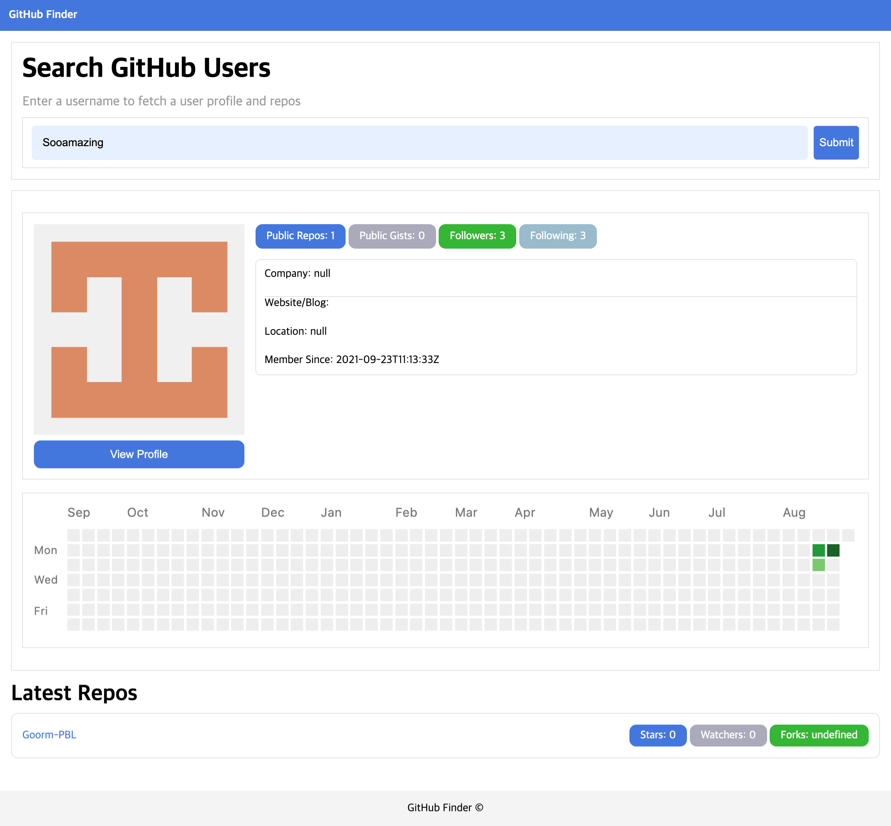

# Github Finer 구현

## 구현하고자 한 것

### 학습 목표

- JS OOP를 이용해 구현하기
- 비동기 방식으로 Github API를 이용해 사용자 명을 검색해 프로필 일부 정보, 잔디밭, Repo 5개 가져오기
  - Fetch 사용 시 Promise 타입으로 저장, async, await 사용해야 배열, 객체로 접근 가능

## 기록

### 배운 점

- Github API를 사용하는 법(키 사용)
  - 키 사용하는 법이 잘 안 나와서 /users 페이지에서 나오는 그대로 배열, 객체로 받아 와 length 이용
- JS 파일을 클래스 별로 나눠서 관리하기
  - import 이용 시 type을 module로 해야 함
  - class를 먼저 써 줘야 하는 것처럼 html 내 script 순서가 중요
- input width가 100%가 되지 않는 문제
  - CSS 속성 grid와 안 맞아서 width: 100%;가 먹히지 않았음. 추후 CSS 속성 정의 시 정리해서 정의하기
- width로 되지 않고 overflow를 사용해야 넘어가지 않음
  - width, height, overflow는 각각. 제각각인 성질이기 때문에 항상 각각 확인하고 설정하기
- JS, addEventListener 시 Btn에 하면 되지 않는 문제
  - Btn으로 submit 이벤트가 발생하기 위해서는 form 필요하고, form에서 submit을 실행하는 거라서 form에서 실행해야 함.
- user 검색이 되지 않을 때 예외 처리
  - try catch 사용해 발생하는 모든 예외 시 예외 문구 출력

### 개선하고 싶은 점

- ``, InnerHTML 이용 시 보안이 좋지 않다고 함. 다른 방식 생각해 보기
- repo 최근으로 정렬해 보여주기 (sort 이용)
- input 너비 100%로 주기
- Not found 시 CSS로 상단 혹은 다른 곳에 몇 초 알림창 나오게 해 보기
- spinner 추가해 보기
- 각 기기 사용환경 (크게)에 맞춰서 변화할 수 있는 CSS 라이브러리 등 확인해 보기
- 입력 창 내부에 버튼이 들어가게 삽입해 보기 (absolute 이용?)
