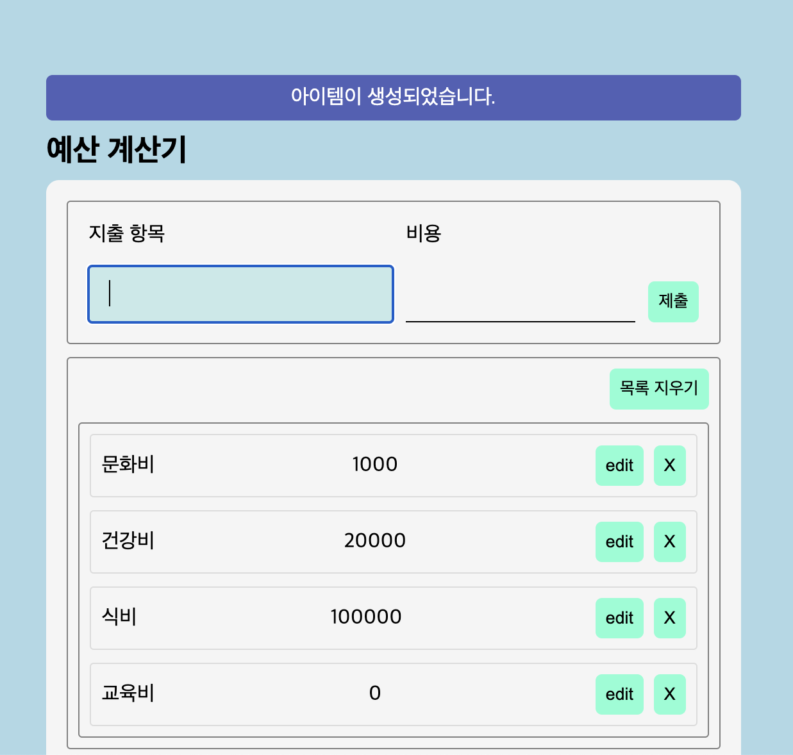

# React 이용해 CRUD 구현

- 2초 알림창
  
- button 사용감, input focus 효과, 지출 계산

## 구현하고자 한 것

### 학습 목표

- 컴포넌트 잘게 쪼개서 구현하기
- Typescript 이용해서 코드 작성하기
- 폴더 및 변수 이름 명확하게 작성하기

### 그 외 신경쓴 점

- button 및 input 클릭할 때 차이 주려 함.
  - button: hover, active 둘 다 구현, 크기와 색으로 차이
  - input: focus 시 글자 크기, 굵기, 바탕색 변화
- 알림창
  - 생성 성공, 미입력 시 재시도, 삭제, 수정 알림 구현, useEffect로 setTimeout, clearTimeout 사용해 시간 차이 만듦

-------------------- Update 9.18

## 기록

### 배운 점(어려웠지만 해낸 것)

- 그 전엔 사실 있는 줄도 몰랐던 event의 타입을 보는 법을 배움.
- form에서 onSubmit을 이용하면 input이 여러 개여도 접근할 수 있음
  - 이때 target["name"] 사용
- key를 변수로 사용하는 건 위험하다.. (Alert에 원래 key 사용해서 넘겨줬는데, 계속 안 됐고. 혹시나 변수를 바꾸니 잘 됐음.)
- input type=number로 설정하면 숫자가 아니면 제대로 입력하라고 경고가 나온다는 점, 셀렉터로 받아올 시에는 string으로 받아와지기 때문에 number로 사용 원한다면 parseInt 사용
- switch문에서 break없으면 나는 에러가 fall through라는 점을 배웠음....
- JSX 사용 시 string 저장한 변수의 내용을 그대로 사용하고 싶을 때는 ${} 같은 거 아니고 그냥 입력하면 됨(alertMessage 참조)
- input 선택은 되는데, value가 받아지지 않는 상황
  - getElementById는 HTMLElement 타입이라서 타입 단언(as HTMLInputElement) 사용해야 value로 접근 가능함!
- (중요) useState 함수는 값 변경을 해당 함수가 끝나고! 해 주니 함수 내에서 업데이트된 useState full을 사용하면 error! 따로 변수 만들어서 사용해 주기! (edit,delete,update 전부 이 error)
- 일반 변와 state함수 이용은 state를 관리할 필요가 있는 경우를 기준으로 둠, state로 관리한다는 건 상태 변화에 따라 화면에 보여주는 걸 결정하는 것.
- list 안 지출 항목과 비용을 내용 길이에 관계없이 똑같이 맞추고 싶었는데, flex로는 할 방법을 찾지 못했음
  - grid로 fr 비율 정해서 해결, span도 nowrap, hidden, margin-right 속성으로 원하던 대로 해결
- 수정 버튼 누를 때가 아니라 누르고 제출 누르면 수정 알림 나오게
  - setMode 이용해서 CREATE, EDIT 상태 저장 후 if 조건문으로 기능 구현
- 수정 버튼 누른 후 해당 list 삭제 후 제출 누르면 error(해당하는 id 없어서)
  - DELETE 후 제출 누르는 상황이라 판단, DELETE 후에는 조건문 판단 에 이용하는 변수값에 CREATE 저장 후 진행(useState 이용 시 바로 update되지 않아 변수 할당)

### 개선하고 싶은 점

- 현재 setExpenses 처음으로 입력하면 업데이트되지 않고 두 번째부터 저장돼 생성, 수정, 삭제 다 처음엔 오류 발생 -> 이유 확인 후 개선
- 함수, 컴포넌트를 가독성 좋게 분리할 수 있다면 그렇게 진행
  - 각 필요한 함수를 컴포넌트에 넣기
  - inputForm도 나눌 수 있으면 나누기
  - Container-Presenter 패턴 등 리액트에 있는 패턴 확인
  - set도 같이 넘겨주면 업데이트할 수 있는 점 고려
- getElementById, nextSibling 등 정적..인 것 같은 코드를 짰는데, 여유된다면 조금 더 동적으로 구현 가능한지 확인하고, 개선하기
- TDD해 보려고 했으나 ... 구현하기에 바쁘기도 하고 TDD가 아직 익숙지 않아 구상만 대략 하고 실행하지 못함. 여유된다면 마찬가지로 TDD 방법도 익혀보면 확실히 도움될 듯. (console.log 찍는 것보다 좋을 것 같음.)
- 수정 시 바로 삭제하는 게 아니라 수정한 내용을 제출하지 않으면 그대로 다시 저장할 수 있도록 구현
- 잘못 지우면 되돌리는 버튼
- 드래그 드롭으로 순서 바꾸는 기능
- 지출 항목에서 엔터 시 제출이 아니라 비용으로 넘어가 => JS에서 요소 잡고 focus 메소드 사용!! useRef 이용하면 이상적..
- li scale 외 움직임 및 그림자 효과

### 더 배우고 싶은 점

- React.StrictMode 등 Provider 개념은 아직 희미
- useContext, Reducer 처음에 사용 시도했는데, 잘 안 돼서 우선 되는 걸로 함. 쇼핑몰 만들 때 다시 시도해 보기
- 타입 정의 전부 하고 쓰고 싶었는데, e...부터 조금 어려워서 뒤로 미룸... 리액트 과제 내에서는 할 수 있길. -매개 변수 타입 정의할 때 객체 디스트럭처링에서 쓰는 건 또 다른데 이런 것들 공부하기
- useState, useEffect도 조금 더 제대로 사용할 수 있게 공부하면 좋겠다. 현재는 useState는 사용법 익혔는데, useEffect는 아직 잘 모르겠음.
  - 계속 잘못 눌렀을 때 계속 알람 주고 싶다면 dependency로 어떤 걸 주면 좋을지 등
- setTimeout 및 비동기 함수 사용에 대해서도 개념 등 익히면 좋을 듯.
- CSS는 그냥 App.css에 다 몰아 넣었는데, 어떻게 하는 게 더 좋은지... 비교해서 배우면 좋을 것 같다.
- HTML 구조 짠 후에 컴포넌트 분리하고, props 내리면서 함수 같이 구현했는데, 이것도 어떻게 다들 하는지 알면 좋겠다.
- e.target["category"].value (e.target==form), document.getElementById("category") as HTMLInputElement 이 둘은 input을 가리키는데, 후자에서는 as HTMLInputElement 가 없으면 value 값을 받아오지 못함. 왜 그럴까.
- 비슷하게, HTML 입력된 id값과 객체에서의 id값 타입은 다름. HTML은 모두 string인 걸까?
- input onChange 사용법
- state는 무조건 값 바뀔 때 업데이트, useRef는 값 바뀌어도 렌더링 X,const로 하면 + 초기화까지 됨. ==> 다시 공부하고 적절하게 선언해서 사용해 보기!
- prop… state 변수를 넘겨주면 그걸 변경하는 건 되나? (input쪽도 아예 component로 분리 가능한지, 원래 분리하려고 시도했다가... state 변경이 안 되는 건가 해서 form으로 밀어넣음.)
- useState를 컴포넌트 내의 함수에서 선언하면 안 되는 이유 확인(우선 파일 읽을 때 상위에 있는 훅만 읽어서 뭔가 처리해서 그렇다 들음)
- useEffect(() => {}, [expenses]); useState 함수 이용한 변수를 dependency에 넣어주는 것도 의미는 있으나 배열인 경우 같은 값이어도 다르다고 판단할 수 있음. -> 적절한 타입 선언 필요, 해당 내용 공부

### 잘한 점

- 하루종일(9/17) 구현하고자 했던 건 대략 구현한 것 같아서 뿌듯하다.
- 최대한 CSS, JS 모두 하나하나 실제 잘 적용되는지를 확인하면서 짜려고 노력했다.
- 처음엔... 컴포넌트 분리하고, props 내리는 것도 어려웠는데, 그 사이에 경험치 쌓였는지 나중엔 그래도 뚝딱이며.. 뭔가 해결하는 속도가 나름 빨라지고, 이렇게 하면 되려나 싶은 생각도 꽤 해서 기뻤다. 진짜.. 알림이랑 수정이 안 돼서... 그건 그냥 포기하고 자야지 하다가... 좀만 더 건드려볼까 하고... 했는데! 비록 새벽 4시까지 한 거지만.. 그래도! 얼추 구현을 했다는 게 아주.. 신기하고 장하고. 하려고 하면 어떻게든 되는구나 싶었다.
- 첫 TODO에 진짜 아무 것도 모르겠고 너무 어렵기만 해서 HTML, CSS는 내가 짜더라도 JS는 클론 코딩 및 수정했는데, 지금은! 물론 강의 들었지만! 참고 정도는 했지만! 내가! 코드를! 짰다! 한 달 만의 성장!
