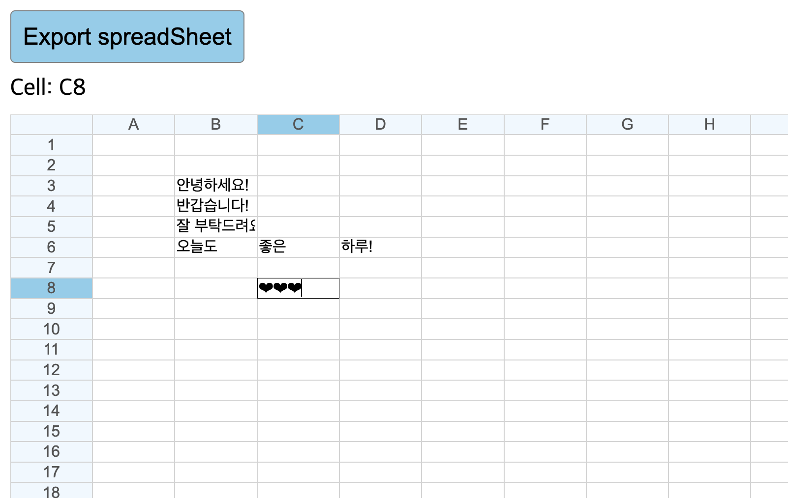

# Goorm-PBL

### Frontend(HTML, CSS, JavaScript, React)

- 기간: 2021.08.30 ~ 2021.09.20

### 1. Netflix Clone Coding

- [Netflix Main Page Clone](pbl1_netflix)
- 학습 목표: `HTML`, `CSS`를 사용하여 넷플릭스 클론 코딩하기
  

### 2. To Do List

- [To Do List](pbl2_todo)
- 학습 목표: To ㅇDo List를 만들며 `HTML`, `CSS`, `JavaScript` 기본 CRUD 익히기
  

### 3. GitHub Finder

- [GitHub Finder](pbl3_githubfinder)
- 학습 목표: 비동기 방식으로 Github API를 이용해 사용자 정보 가져오기
    - 사용자 명을 검색해 프로필 일부 정보, 잔디밭, Repo 5개 가져오기
      

### 4. SpreadSheet

- [SpreadSheet](pbl4_spreadsheet)
- 학습 목표: SpreadSheet 만들며 구조 이해하기
    - 배열과 cell 객체 이용해 구현
    - 작성된 모든 데이터를 csv로 변환
    - 방향키, 엔터키 이동
    - focus 시 header 변경
      

### 5. Budget Calculator

- [예산 계산기](pbl5_budgetcalculator)
- 학습 목표: 예산 계산기(Budget Calculator) 만들며 React 기초 익히기
    - React 기초, Component, State, Props, Event Handler, React Hook, useState, useEffect
      

## Backend(Java, Spring)

- 기간: 2021.09.21 ~ 2021.10.30

### 8. LinkedList

- [LinkedList](pbl8_linkedlist)
- 학습 목표: `Java` 언어로 `LinkedList` 구현하기

### 9. Cart System

- [장바구니](pbl9_cart)
- 학습 목표: `Map`, `Set`으로 `Cart System` 구현하기

### 10. Response Model(Error Handling)

- [에러 응답 모델](pbl10_response-error-model/response-error-model/README.md)
- 학습 목표: `Spring Boot`에서 에러 응답 모델을 만들어 응답과 에러 공통 처리하기

### 11. CRUD Board

- [게시판 CRUD](pbl11_crudboard/crudboard/src/main/java/goorm/crudboard/README.md)
- 학습 목표: 게시판 CRUD 구현하기
    - `Spring Boot`, `Spring Data JPA`, `H2` 사용
    - 기본 CRUD와 BaseEntity, Paging, N+1 처리

