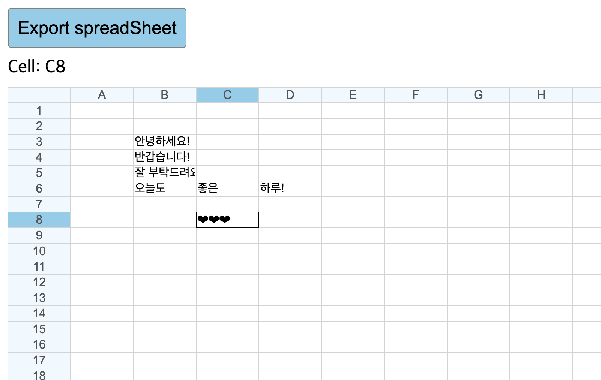

# SpreadSheet

## 구현하고자 한 것

### 학습 목표

- focus된 셀의 위쪽, 왼쪽 헤더의 배경색 변경하기
- 작성된 모든 데이터를 Excel 파일로 만드는 버튼 생성하기
- 생성된 Excel 파일을 구글 SpreadSheet에서 Import 시 같은 데이터가 나오게 하기

### 기타 목표

- 구현 사항을 코드로 표현하는 법 배우기.
- 방향키, 엔터키로 이동할 수 있게 하기.
- click뿐 아니라 focus 시 header 변경.

## 기록

### 배운 점

### HTML

- Cell: {focus 셀 위치}
    - 해당 셀 위치만 span으로 사용하는 게 좋음!

### CSS

- :root와 body, *은 전부 다름.
- cell에 display:flex 설정해야 안 망가지고 표처럼 보임.

### PORT 설정

- .vscode 폴더 내 settings.json에서 PORT 설정 가능
    - {"liveServer.settings.port": 3300}

### JS

- 구현
    - Cell 객체 이용
        - header(isHeader, disabled,active )
        - cell 위치(row,column)
        - cell 이름(id 생성 및 보이는 위치)(rowName,columnName )
          - cell 값(data)
    1. Cell[][] spreadSheet 배열 내에 객체 담기 
        - header 관련 정보 판별, cell 위치, 이름 등 생성자로 생성
    2. 실제 화면에 그리기
        - row element 에 cell-row class 추가하고, 각 cell에 class 설정하고 반환받은 Element 집합을 cellContainer Element에 append 진행
        - 각 cell에 class 설정: cell 객체를 넘기면, 해당 객체에서 얻은 정보로 id, class, attribute 등 설정해 Element 반환
          - column+row으로 구성 시 수가 늘어나면 중복 id 발생 -> columnName+rowName으로 설정
          - tab 으로 이동하기 추가 -> 원래 되는 거였음.
          - 이벤트 함수 등록은 각 input element(cell)에 등록해야 작동!
            - cellEl에 focus하면 강조 위해 header Cell 객체의 정보가 바뀌는 함수
              - header 정보 초기화부터!
                - 요소를 전부 탐색해 Cell 객체에서 isHeader인 경우 El 찾아 active class 제거.
                - clearHeaderActiveStates()
              - Cell 객체의 row, col 정보로 headerEl 찾아오기
                - getElFromRwoCol(rowName, columnName)
              - 활성화된 cell 위치 표시 (""로 문자열 연산 이용)
              - cellEl.onfocus = () => handleCellFocus(cell);
            - cellEl 내용 바뀌면(입력하면) 해당 내용을 객체에 저장하는 함수
              - cellEl.onchange = (e) => handleOnChange(e.target.value, cell);
            - 방향키로 이동
              - 인자 두 개 넘기는 방법 성공!
              - 방향키 이동 추가 안 하면 방향키 눌러도 움직이지 않을 뿐 작동한 건데, focus 설정을 함으로써 실제 방향키가 작동했다는 느낌을 줌.
              - keyup 은 누르고 있어도 반복이 안 됨 -> keydown은 가능!
                - cellEl.addEventListener("keydown", (e) => keyEvent(e, cell));
    3. csv로 변환하는 버튼 구현
       - header가 아닌 cell의 data를 전부 csv에 저장
       - csv import - a 태그 생성
         - a.download 이름 설정 시 .csv를 제거하면? -> txt 기본.
         - a.click(); 과정까지 해야 다운로드 가능!

### 개선하고 싶은 점

- 엑셀처럼 드래그로 여러 범위 선택!
- 추후 여유가 있다면, 스스로 다시 한번 구현해 보기!

### 더 배우고 싶은 점

- :root의 적용 범위?
- cell에 display:flex 설정해야 안 망가지고 표처럼 보이는 이유? (container가 아니라 cell에 적용했는데 되는 이유)
- if(!data){ data=""} -> 이건 왜 가능했을까?
- cell이라고만 넘겼는데 관련 속성 사용 가능 -> ... JS는 이걸..... 오류 안 나게 쓰는 방법이 뭘까? Ts 말고는?
  - 실제로 exportBtn,onClick으로 오타, [csvObj] 오타난 걸 한참 찾음.
- 왜 \r\n 둘 다 사용하지?
- join 사용 시 String 반환 ?
- Blob 은 무슨 타입?
- csv import 시 해당 a는 어디에 생성되는 걸까? html에 추가되지 않고도 생명력을 지닌 것?
- 방향키로 이동 시 PageUp, PageDown는 어떻게 구현할 수 있을까?

### 스스로 칭찬하기 & 느낀점

- 23/10/30 약 9뽀모? 코드 분석을 위주로 하되, click 시 이벤트를 focus로 변경하고, tab과 click으로만 이동하던 걸 방향키와 엔터로도 이동 추가 구현
- 화면과 로직을 연결해서 생각하는 게 어렵다. 이 부분을 더 연습하고 싶다!
- 사실 좀 더 이거저거 해 보면 좀 와닿을까 싶어서 미룬 건데, 지금도 딱히 엄청나게 나아진 것 같지는 않아서 뭐든 그냥 냅다 집어 넣고, 출력을 하는 편이 낫겠다는 생각을 하는 중!
- 그래도 이렇게 틀이 있으면, 이를 이용해서 이거저거 응용하는 건 할 수 있어서 다행이다!
- 원하는 걸 추가 구현한 게 뿌듯하다! 블로그 참고했지만, 쓱 보고 이렇게 바꾸면 되겠구나 싶어서 스스로 바꿀
  수 있다는 게 ! 매우 ! 기분이 ! 좋았다 ! 그래도 이 정도는 성장했구나 하는 생각!

### 참고
- [이벤트 함수에 파라미터 두 개 이상 넘기는 방법](https://23life.tistory.com/158) 
- [키보드 방향키로 이동하는 법](https://harui.tistory.com/171)